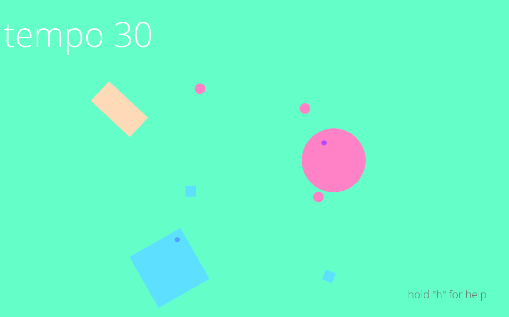
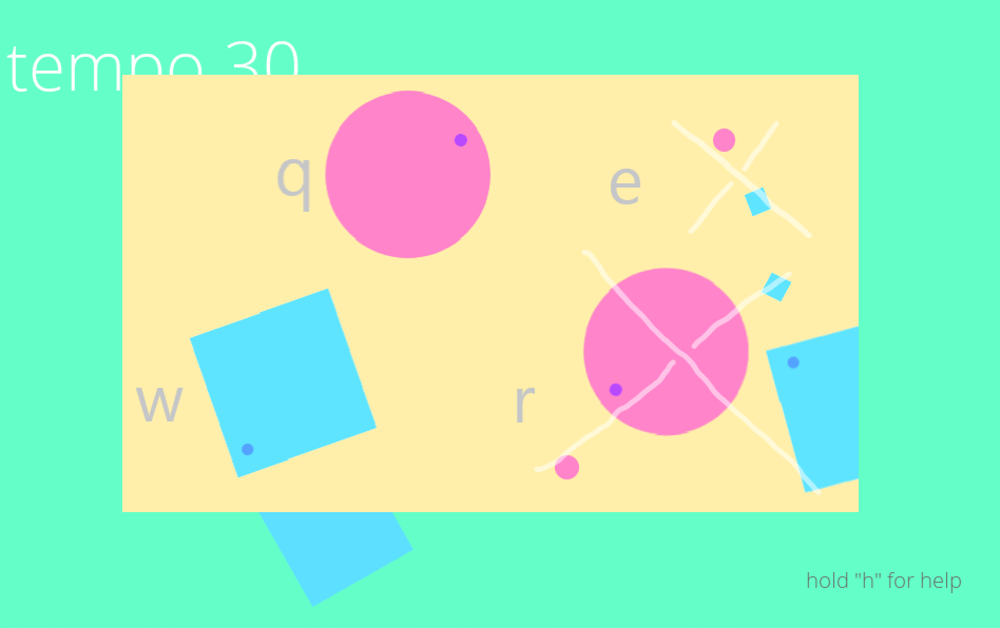

# bloink-game
A fun game about making music, made with Love2D

### how it works
There are two types of *emitters*: square and circle. They send little circles and squares respectively into the scene. When those little projectiles collide with other things in the scene they make a sound, whose pitch coorelates to the velocities of the moving bodies involved.

*Paddles* can be placed and rotated anywhere in the scene to influence the direction of the projectiles that bounce off of it.

### how to play 
Download love2D from [love2D.org](http://www.love2d.org). On Mac or Linux simply add love to your path, navigate to the directory of main.lua and run `love .`.

### screen shots

